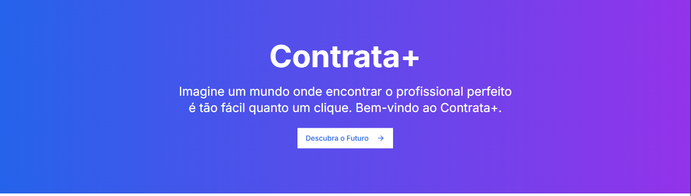

# 🚀 Contrata+

<p align="center">
  
</p>

## 💻 Projeto

Esta é uma landing page que apresenta nossa plataforma inovadora de conexão entre profissionais e clientes. Com um design moderno e responsivo, apresentamos nossa proposta de valor e principais funcionalidades do serviço.

## ✨ Tecnologias

- [Next.js 14](https://nextjs.org/)
- [React 18](https://reactjs.org)
- [TypeScript](https://www.typescriptlang.org/)
- [Tailwind CSS](https://tailwindcss.com/)

## 🔍 Features

- ⚡ Performance otimizada com Next.js
- 🎨 Design responsivo
- 💫 Animações suaves
- 📱 Interface adaptativa
- 📨 Formulário de contato

## 🚀 Como executar

```bash
# Clone este repositório
$ git clone https://github.com/Aldacelio/landing-page-contrata-frontend

# Entre na pasta do projeto
$ cd landing-page-contrata-frontend

# Instale as dependências
$ npm install

# Execute a aplicação
$ npm run dev

# O site estará disponível em http://localhost:3000
```

## 🎨 Layout

A landing page foi desenvolvida com foco em:

- Apresentação clara da proposta
- Visual profissional e atraente
- Navegação intuitiva
- Design responsivo
- Call-to-actions estratégicos

---

Feito por Aldacélio 👋 [Entre em contato!](https://www.linkedin.com/in/antonio-aldacélio-a42a1212b/)
